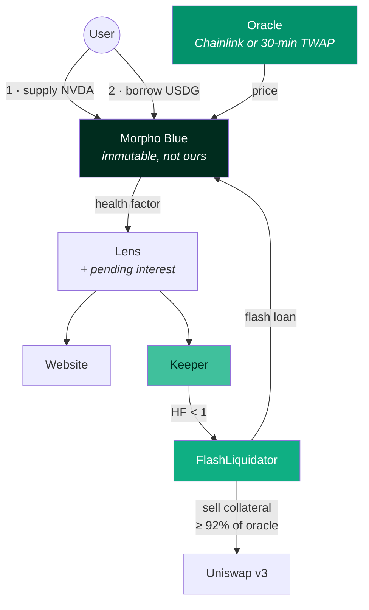
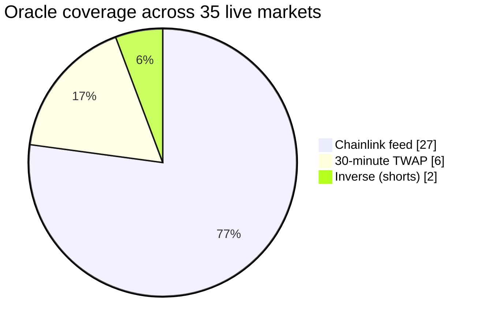
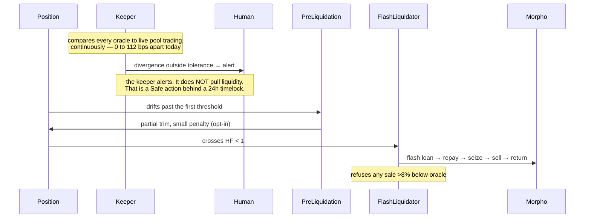
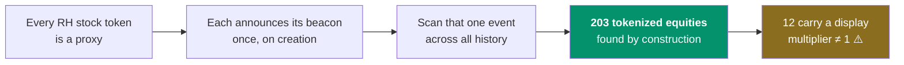
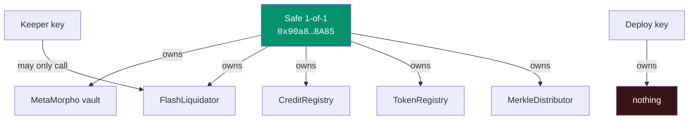

<p align="center">
  
</p>

<h1 align="center">Cluby</h1>

<p align="center">
  <b>A credit layer for tokenized stocks, on Robinhood Chain.</b><br>
  Post tokenized NVDA, SPY or AAPL as collateral and borrow USDG against it — without selling the position.
</p>

<p align="center">
  <a href="https://cluby.cash"></a>
  
  
  
  
  <a href="LICENSE"></a>
</p>

---

## We did not write a lending protocol

Deposits, collateral, debt and liquidations live inside [Morpho Blue](https://github.com/morpho-org/morpho-blue) — immutable, audited, and impossible for us to upgrade or reach into.

What is in this repository is the **curation layer above it**: the markets, the oracles, the risk parameters, the routing, the keeper and the interface. None of it takes custody. The routers hold no balance between transactions, and the liquidator funds itself entirely from flash loans — which is why the protocol needs no treasury standing behind it.

> Your money sits in code that cannot change, and our code cannot touch it.

---

## How a position actually works



The user's collateral and debt sit in Morpho throughout. Nothing we deployed ever holds them.

---

## The repositories

The protocol is split by concern. Each repository builds, tests and deploys on its own.

| Repository | What it holds | Tests |
|---|---|---|
| [**cluby-oracles**](https://github.com/clubytech/cluby-oracles) | A TWAP that verifies its own pool's observation ring, an inverse for shorts, and `min(feed, twap)` | 10 |
| [**cluby-liquidator**](https://github.com/clubytech/cluby-liquidator) | Flash-loan liquidation with a price floor read from the oracle at the moment it acts | 4 |
| [**cluby-leverage-router**](https://github.com/clubytech/cluby-leverage-router) | Leveraged open and close, settled in one transaction | 9 |
| [**cluby-lens**](https://github.com/clubytech/cluby-lens) | Every number the site and keeper read, with pending interest applied | 12 |
| [**cluby-incentives**](https://github.com/clubytech/cluby-incentives) | Scores, Merkle rebates that cannot be published unfunded, staking | 16 |
| [**cluby-token-registry**](https://github.com/clubytech/cluby-token-registry) | Where a token's address is announced, ticker read from the token itself | 7 |
| [**cluby-keeper**](https://github.com/clubytech/cluby-keeper) | The watchdog. Every power it has reduces exposure | — |
| [**cluby-mcp**](https://github.com/clubytech/cluby-mcp) | So an agent can read the protocol directly | — |
| [**cluby-sdk**](https://github.com/clubytech/cluby-sdk) | One implementation of the arithmetic, shared by all of the above | — |

This repository is the monorepo they were split from, and still holds the interface, the indexer, the deploy scripts and the fork tests.

---

## The parts, and what each one is for

| Contract | What it does | Why it is interesting |
|---|---|---|
| [`TwapOracle`](contracts/src/oracles/TwapOracle.sol) | A 30-minute time-weighted price from a Uniswap v3 pool | **Refuses to deploy against a pool whose observation ring is too short for its own window.** Most TWAP oracles do not check, and a pool that cannot answer a 30-minute question will happily answer a wrong one |
| [`InverseOracle`](contracts/src/oracles/InverseOracle.sol) | The same price read from the other side | Lets a stock be the *borrowed* asset, so you can short it. Same feed, same trust, no second source to disagree |
| [`MinOracle`](contracts/src/oracles/MinOracle.sol) | The lower of two sources | `max()` protects a lender of shares; `min()` protects a lender of cash. We lend cash |
| [`Lens`](contracts/src/periphery/Lens.sol) | Every number the site, keeper and indexer read | Applies **pending interest** before answering. A health factor computed from stale debt is too generous — exactly the direction that makes a liquidator's simulation disagree with the transaction it then sends |
| [`FlashLiquidator`](contracts/src/periphery/FlashLiquidator.sol) | Liquidation with zero capital | Reads a **price floor from the oracle at the moment it acts** and refuses to sell collateral more than 8% below it |
| [`LeverageRouter`](contracts/src/periphery/LeverageRouter.sol) | Leveraged open/close in one transaction | Flash loan, swap, supply, borrow, repay — settled together, with the resulting health factor shown before signature |
| [`CreditRegistry`](contracts/src/incentives/CreditRegistry.sol) | Borrower scores | The score changes what a borrower is **paid**, never what they may **borrow**. That line is the whole design |
| [`MerkleDistributor`](contracts/src/incentives/MerkleDistributor.sol) | Weekly rebates in USDG | **Refuses to publish an epoch its own balance cannot cover.** A published root is money already in the contract, not a promise |
| [`TokenRegistry`](contracts/src/token/TokenRegistry.sol) | Where the token's address is announced | The ticker is read from the token's own `symbol()`, so the label and the contract cannot disagree |

---

## Where the price comes from

A lending protocol is a bet that its price is right at the moment it matters. Ours comes from two places and **never from a blend**, because a blend is a third failure mode nobody tests.



**Chainlink, where a feed exists.** The feed is wrapped so the number arrives in the exact form Morpho expects, decimals folded in.

**A thirty-minute time-weighted average, where a feed does not.** Not a spot price — spot on a shallow pool is a suggestion, and buying it for one block costs less than the loan it would unlock.

Here is the part almost nobody does. A Uniswap pool can only answer a thirty-minute question if it has kept thirty minutes of answers, and **by default it keeps about one.** Extending that memory is permissionless, is not free, and is nobody's job — so it does not get done, and TWAP oracles get deployed against pools that cannot serve the window they claim.

> We bought the memory on every pool we price against, out of our own pocket, before the market opened. Each of those rings now holds up to eighteen hundred observations. The oracle contract refuses to deploy against a pool whose memory is too short for its own window, and it cannot be configured around.

---

## Risk tiers, fixed at creation and editable by nobody

Morpho only accepts liquidation thresholds its own governance has enabled — on this chain, nine specific values. Our risk plan asked for two that are not among them: 70% for TWAP-priced megacaps and 66.7% for shorts. Both were pinned to the nearest enabled value **below** the target rather than the plan being redrawn around what was available.

| Tier | LLTV | Markets | Liquidator bonus | Collateral must fetch ≥ |
|---|---|---|---|---|
| Treasuries | 86% | 1 | 4.38% | 95.8% of oracle |
| ETH | 77% | 1 | 7.41% | 93.1% of oracle |
| Equities and index ETFs | 62.5% | 20 | 12.68% | 88.75% of oracle |
| Long tail | 38.5% | 11 | 15.00% | 86.96% of oracle |

An LLTV is written into a market's **identity**, not into its storage. The address of a market is derived from its parameters, so changing one does not edit a market — it names a different market that does not exist.

**There is no governance path to your liquidation threshold because there is no function that could be called.**

---

## What happens when a position goes bad, in order



**It raises an alert rather than acting, and that is the design rather than an unfinished feature.**

The keeper is not an allocator on the vault. It cannot set a cap, cannot move liquidity, cannot open a position, cannot change a parameter, and cannot touch anyone's funds. The only write it is permitted is calling the liquidator on a position that is already underwater by the market's own arithmetic.

> The tempting version is a keeper that pulls liquidity automatically at 3am and tells you in the morning. It is also a key on a server with the authority to drain a vault into a market of its choosing. We would rather be woken up.

---

## Things this repository knows that cost us something to learn

Every one of these is a comment in the code, not a blog post.

**A tokenized stock can lie about its own balance.** Twelve of the 203 tokenized equities on this chain carry a display multiplier that is not one — one holds a single unit and shows you four. It is a presentation field. A protocol that reads it as a quantity misprices collateral by a factor of four and never notices until a liquidation fails to clear. See [`docs/chain-facts.md`](docs/chain-facts.md).

**A Uniswap pool only remembers about one minute by default.** A 30-minute TWAP against a pool with a 60-second observation ring is a number that looks like a price.

**A call into an address with no code reverts with *empty* data.** One deploy was handed an address sharing four leading bytes with Morpho's and nothing else. Every read failed with no reason string, which reads downstream as "this market is broken" rather than "this deploy is broken". The constructor now rejects a codeless address, and [`DeployLens.s.sol`](contracts/script/DeployLens.s.sol) calls a live market *through the contract it just deployed* before it will print an address worth pasting anywhere.

**`cast send` exits 0 on a transaction that mined and reverted.** A transaction over the node's per-transaction gas ceiling is not rejected — it is mined, burns the entire limit, and moves nothing. Scripts here read the status rather than the exit code.

**A metered endpoint that runs out does not fail quietly.** It refuses every call, promptly, and a backfill will spend its whole request budget being told no while looking perfectly healthy. The indexer believes the first refusal and stops asking.

**An alerting bot that cannot tell a dead node from a broken market will page you 96 times in an hour.** Transport failures are now collapsed into one alert per pass, and the keeper says when something started working again.

---

## The chain had to be enumerated before anything could be listed

There is no token list for tokenized equities on this chain. No directory, no registry, no subgraph. If you want to know what exists, you have to derive it.



Anyone building here should go and check those twelve for themselves. It is the single sharpest edge on this chain and it is not documented anywhere.

---

## Ask an agent about the protocol

There is an [MCP server](apps/mcp) in here, so a model can read Cluby directly instead of being told about it. Everything about the present comes from the chain; only history and liquidations need the indexer, which is optional.

```sh
CLUBY_RPC_URL=<rpc> pnpm --filter @cluby/mcp start
```

| Tool | Answers |
|---|---|
| `list_markets` | every market, with price, rates and whether it exists on chain |
| `get_market` | one market in detail |
| `get_position` | a borrower's collateral, debt, health factor and liquidation price |
| `quote_borrow` | what a borrow would do, and whether it exceeds the cap the app enforces |
| `quote_multiply` | exposure, debt, LTV, health factor and liquidation price of a leveraged position |
| `list_vaults` | the Earn side, with fee and timelock |
| `protocol_facts` | addresses, fee split, LLTV tiers, how to take a free flash loan |

The quotes are the same arithmetic the interface signs against, not a second implementation that can drift from it.

---

## Repository layout

```
contracts/src/          the protocol — oracles, periphery, incentives
contracts/test/         101 unit tests + fork tests against live mainnet state
contracts/script/       deploys, each one verifying its own result before printing an address
packages/config/        every address, market and risk parameter, in one place
packages/sdk/           reads and transaction builders
apps/web/               the interface (Next.js)
apps/keeper/            the liquidation and oracle-divergence watchdog
apps/mcp/               MCP server — markets, positions and pre-trade quotes for an agent
apps/indexer/           Ponder indexer and the API the site reads
ops/systemd/            how the keeper and indexer are actually run
docs/                   chain research: what exists on this chain and what can be priced
```

---

## Who owns what



- The lending primitive is Morpho Blue's own deployment, and it is not ours.
- The vault is a standard MetaMorpho V1.1 vault, from Morpho's sources, unmodified.
- The pre-liquidation factory is Morpho's, deployed from their sources because they had not deployed it here.
- Everything else — oracles, router, liquidator, data contract, registries — is ours, verified, and listed with its address in the docs.
- **Vault timelock: 24 hours.** The performance fee is zero today, and raising it is submitted publicly and cannot execute for 24 hours.

---

## Risk, stated plainly

- **Liquidation thresholds are immutable.** There is no function that could change one.
- **Markets are isolated.** A bad debt in one cannot reach another.
- **The performance fee is zero today**, and raising it sits in public for 24 hours first.
- **Caps start deliberately low** and rise against measured exit liquidity, not enthusiasm. A cap larger than the pool behind it is a promise the exit cannot keep.
- **Nothing here can be upgraded.** There is no proxy in front of anything we wrote. The Lens has been deployed five times; each version was replaced, not patched — which is safe precisely because none of these contracts holds anything between transactions.

Read [`What breaks, and what happens then`](https://cluby.cash/docs) first. A protocol that will not write that section has not thought about it.

---

## Running it

```bash
pnpm install
cd contracts && forge test              # 101 unit tests
forge test --match-path 'test/fork/*'   # against live mainnet state, needs an RPC
pnpm --filter @cluby/web dev
```

Fork tests read real deployed contracts. Set `ROBINHOOD_RPC_URL` to an archive endpoint for the ones that read historical state.

---

## Security

Found something? See [SECURITY.md](SECURITY.md). Please do not open a public issue for a live vulnerability.

## License

MIT — see [LICENSE](LICENSE).

<p align="center">
  <a href="https://cluby.cash"><b>cluby.cash</b></a> ·
  <a href="https://cluby.cash/docs">docs</a> ·
  <a href="https://x.com/ClubyTech">@ClubyTech</a>
</p>
